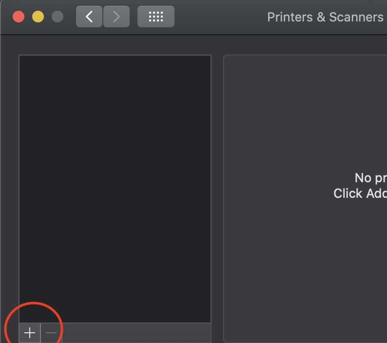

# Adding IST-Printer on MacOS 10.15.X or Higher
This guide will assist staff and faculty in installing the IST-Printer on their Mac machines. If you would like to see extra printing information, please follow this link: https://cist.unomaha.edu/printing  
Note: **YOU MUST BE INSIDE THE BUILDING ON AN ETHERNET CONNECTION OR ON THE VPN WHEN USING WIFI OR FROM OFF CAMPUS FOR THIS TO WORK**
 

 
## AS OF NOVEMBER 2021, MAC PRINTING IS NOT FUNCTIONAL ON SCHOOL NETWORK. YOU WILL NEED TO USE A WINDOWS VIRTUAL MACHINE OR A SECONDARY WINDOWS MACHINE UNTIL FURTHER NOTICE. WE APOLOGIZE FOR ANY INCONVENIENCES THIS MAY CAUSE.
 
## Please remove the old printer first before continuing by following these steps: Open your Apple Menu in the top-left corner of the screen, Select `System Preferences`, then `Printers and Scanners`, select the ISTPrinter from the menu on the left, and press the minus button on the bottom and remove it. Next you will need to remove your credentials from this printer so they don't conflict with the new printer. You will need to open `Keychain Access` or just `Keychain` and select `login` on the left side. This should bring up a list of things. Near the top of the window, next to `All Items` select `Passwords`. Scroll through this list until you find "ISTPrinter" (Or whatever you decided to name it) and delete that entry.

1. Download and install the driver for MacOS that are located on the SharpUSA website: https://business.sharpusa.com/product-downloads. You will need to set these options: `"Product Category -> MFPs" "Product -> MX-7580N" "File Type -> Drivers and Utilities"`. Click `Search` and this should open a new page with your options and a list of drivers that you can choose from. Please choose the Mac Driver that is labeled `Mac OS Driver Package` and find the one that has `PS Mac OS 10.x to 10.x` that fits your operating system. You can find the OS number in the About section of your Mac. This will download a zip file. To install the driver, you will need to extract the contents of the zip file to your desktop. This will give another zip and a folder. You will need to open the folder and run the .dmg file and go through the install process.

2. Click on the apple on the top-left corner of the screen.

3. Click `System Preferences`

4. Click on `Printers and Scanners`

5. In the new window, look for the + and click it

6. In the blank space beside the options that say `Default, IP, and Windows`, Right click or hold control and click, then select `customize toolbar`. Find the `Advanced` icon and drag that next to the shaking icons to add it to the toolbar and hit done. 

7. Click the `Advanced` icon, and let it load. Once it loads, change the type to `Windows printer via spoolss` and device to `Another Device`. Once those have been set, change URL box to say `smb://oist-printers.unomaha.edu/IST-Printer`   
In the Name field, add IST-Printer to avoid confusion. 

8. Under `Use` click `Select Software` and scroll down until you see `SHARP MX-7580N PPD`. Select this option. Hit OK when you have changed the other settings. This will lead you to a next page that asks for more set up options. You will want to set each one as the following: `Input Tray Options: MX-LC13, Bypass: Installed, Output Tray Options: Finisher (Large Stacker), Punch Module: 3 Holes, Right Tray: Not Installed, Data Security Kit: Not Installed`.

9. Once the printer has been set up, you can right click it and set as default. Then run a test print by opening the printer Queue, and at the top, select `Printer` and `Test Page`. This should bring up a window asking for your credentials. **Fill in your full UNO email address and your UNO email password to log in.** If it doesn't take your email address, try just your NetID (Just remove the @unomaha.edu). Sometimes it can be picky. If you don't want to enter your credentials every time, check the box to store it into keychain. After this, the printer is all set up!

Note: If you would like to to hole punch and/or staple, you will need to click the dropdown during print setup that says `Copies and Pages`, choose printer features and choose the settings you'd like.   
 
Note: If you are getting a `Hold for Authentification` error, your credentials are being rejected by our server. You will need to open `Keychain Access` or just `Keychain` and select `login` on the left side. This should bring up a list of things. Near the top of the window, next to `All Items` select `Passwords`. Scroll through this list until you find "IST-Printer" (Or whatever you decided to name it) and delete that network password. This will tell your Mac to act like it had never seen this printer before and have you log in again. If you keep getting this error after deleting the network password, verify you are entering the correct information. If error persists, contact the PKI Systems office.
